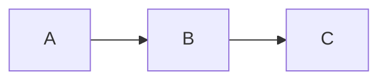

# Contributing

This site is primarily maintained by the research team, but corrections, suggestions, and additions from collaborators are welcome.

## What you can contribute

- **Corrections** — factual errors, broken links, typos
- **Blog posts** — progress updates, notes from supervisor meetings, short technical posts
- **New docs pages** — results pages, model cards, data dictionary entries as the project advances
- **Diagram updates** — keeping Mermaid diagrams accurate as the methodology evolves

## Making a change

1. Fork the repository and create a branch from `main`
2. Make your changes (see [Local development](#local-development) below)
3. Open a pull request with a short description of what changed and why

For substantial changes — new sections, restructuring — open an issue first to discuss the approach.

## Local development

```bash
npm install
npm start
```

The dev server runs at `http://localhost:3000/research-hub/` and reflects most edits live.

## Writing docs

All pages are Markdown (`.md`) or MDX (`.mdx`) files in the `docs/` folder. Docusaurus handles the sidebar automatically based on `sidebars.ts`.

**Front matter** required at the top of each page:

```md
---
sidebar_position: 1
title: Page Title
---
```

**Mermaid diagrams** — use fenced code blocks with the `mermaid` language tag:

````md

````

**Admonitions** — use `:::note`, `:::tip`, `:::warning`, `:::danger` for callout blocks.

## Writing blog posts

Create a file in `blog/` named `YYYY-MM-DD-slug.mdx`:

```md
---
slug: my-post
title: My Post Title
authors: [researcher]
tags: [progress]
---

Opening paragraph shown in the post list.

<!-- truncate -->

Rest of the post.
```

Available tags: `progress`, `data`, `methods`, `results`, `planning`.

## Commit style

One sentence, present tense, describing what changed:

```
Add Phase 2 EDA results to methodology page
Fix broken link in data sources overview
Update Gantt chart to reflect Month 5 progress
```
