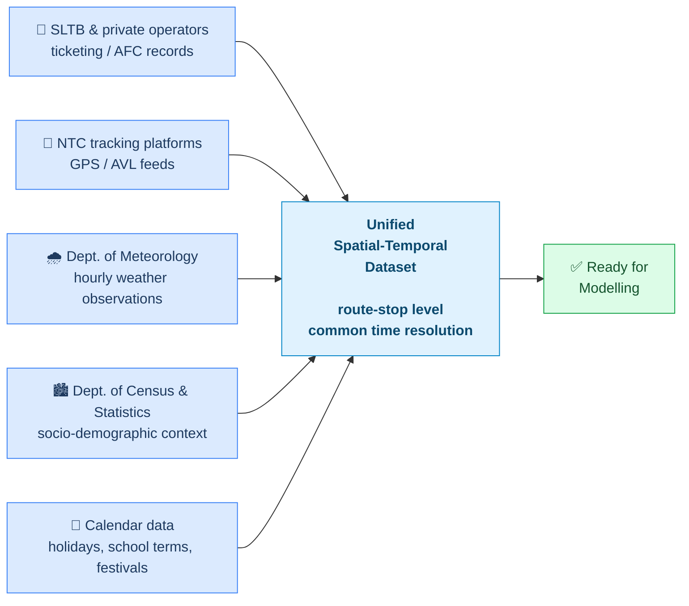

# Data Sources

## Overview

Five heterogeneous data streams are integrated into a unified spatial-temporal dataset. Each stream brings a different type of information about the demand-generation process.

---

## Source details

### AFC ticketing records
| Attribute | Detail |
|---|---|
| **Provider** | SLTB depots and private operator associations |
| **Content** | Transaction timestamps, route ID, stop ID, fare category |
| **Temporal resolution** | Per-transaction (aggregated to hourly/daily) |
| **Spatial resolution** | Stop level |
| **Access status** | Discussions ongoing; subject to data access agreement |
| **Coverage notes** | AFC rollout is partial — older SLTB depots and many private operators still use paper tickets |

### GPS / AVL vehicle traces
| Attribute | Detail |
|---|---|
| **Provider** | National Transport Commission (NTC) tracking initiatives |
| **Content** | Vehicle GPS coordinates, timestamps, route assignments |
| **Use** | Derive stop arrival/departure events; estimate occupancy from dwell times where AFC unavailable |
| **Access status** | Publicly accessible feeds (where available); platform-specific access under investigation |

### Weather observations
| Attribute | Detail |
|---|---|
| **Provider** | Department of Meteorology, Sri Lanka |
| **Content** | Hourly temperature, rainfall, relative humidity, wind speed |
| **Temporal resolution** | Hourly |
| **Spatial resolution** | Observation station — interpolated to corridor midpoints |
| **Rationale** | Weather is a documented demand driver for public transport; rain specifically increases bus demand on informal-transport-heavy corridors |

### Socio-demographic context
| Attribute | Detail |
|---|---|
| **Provider** | Department of Census and Statistics |
| **Content** | Population density, household income, vehicle ownership rate per GND |
| **Temporal resolution** | Static (census-based) |
| **Use** | Route-level demand baseline features; corridor stratification |

### Calendar data
| Attribute | Detail |
|---|---|
| **Source** | Government Gazette (public holidays), Ministry of Education (school terms) |
| **Content** | Public holidays, school term dates, major festivals |
| **Key events** | Sinhala & Tamil New Year, Vesak, Eid al-Fitr, Christmas, Thai Pongal, provincial election days |
| **Rationale** | Calendar effects are among the strongest demand drivers in Sri Lanka — Vesak and New Year produce demand spikes on some routes and near-zero demand on others |

---

## Data quality and fallback strategy

| Data stream | Known risk | Fallback |
|---|---|---|
| AFC records | Partial digitisation; NDA delays | GPS dwell-time proxy for occupancy |
| GPS feeds | Coverage gaps on rural corridors | Reduce corridor scope if necessary |
| Weather | Spatial interpolation error | Use nearest station; document uncertainty |
| Census | 2012 data (next census 2022+); may be stale | Flag as limitation; supplement with satellite proxies where feasible |
| Calendar | Complete and reliable | None needed |

---

## Unified dataset schema

After integration, the dataset is indexed by `(route_id, stop_id, timestamp)` with the following feature groups:

| Feature group | Examples |
|---|---|
| Demand (target) | `boardings`, `occupancy_proxy` |
| Temporal | `hour`, `day_of_week`, `week_of_year`, `month` |
| Lag features | `boardings_lag_1h`, `boardings_lag_24h`, `boardings_lag_7d` |
| Weather | `rainfall_mm`, `temp_c`, `humidity_pct` |
| Calendar | `is_public_holiday`, `is_school_day`, `event_type` |
| Spatial | `route_id`, `stop_id`, `zone_type` (urban/suburban/rural) |
| Sociodemographic | `pop_density`, `vehicle_ownership_rate` |

*Specific features included are subject to refinement based on Phase 2 EDA results.*
