# Machine Learning Methods

## Overview

Tree-based ensemble methods are well-suited to tabular demand forecasting: they handle mixed feature types (numeric weather, categorical calendar events, integer lag features), are robust to missing values, and produce interpretable feature importance scores — useful for answering RQ1.

---

## Random Forest

**What it does:** Builds an ensemble of decision trees on bootstrap samples of the training data, averaging predictions across trees (bagging). Each tree uses a random subset of features at each split, reducing correlation between trees.

**Why it's a candidate:** Strong regularisation through averaging makes it robust to noisy data — relevant given Sri Lanka's partial AFC coverage. Feature importance is straightforward to compute.

**Hyperparameters to tune:** Number of trees, maximum depth, minimum samples per leaf, number of features per split.

**Implementation:** `sklearn.ensemble.RandomForestRegressor`

---

## XGBoost

**What it does:** Gradient-boosted decision trees — builds trees sequentially, each correcting the errors of its predecessors. Uses second-order gradient information for faster convergence, and includes L1/L2 regularisation.

**Why it's a candidate:** Consistently achieves state-of-the-art results on tabular time-series benchmarks. Handles missing values natively (important for incomplete AFC records). The `DMatrix` format supports efficient training on large feature sets.

**Hyperparameters to tune:** Learning rate (`eta`), maximum depth, subsample ratio, column subsample ratio, regularisation terms (`lambda`, `alpha`), number of boosting rounds (with early stopping).

**Implementation:** `xgboost` Python library with `sklearn` API wrapper; hyperparameter search via `optuna`.

---

## Prophet

**What it does:** A decomposable time-series model — fits an additive model of trend, seasonality, and holiday effects:

```
y(t) = trend(t) + seasonality(t) + holidays(t) + noise(t)
```

Trend is modelled as piecewise linear or logistic growth with automatic changepoint detection. Seasonality uses Fourier series. Holidays are specified explicitly as a list of dates with optional window effects.

**Why it's a candidate:** Prophet's explicit holiday and event handling is a particularly good fit for Sri Lankan transit demand — the calendar effects are strong, well-known, and structured (Vesak, New Year, Eid, school terms). Non-statisticians can inspect and adjust the components.

**Limitations:** Univariate in its base form (external regressors require the `add_regressor` extension). Not designed for stop-level granularity — best applied at route level.

**Implementation:** `prophet` Python library; custom holiday list built from Sri Lankan public holidays and school term data.

---

## Temporal cross-validation

All three models are trained and evaluated using **rolling-origin cross-validation**:

```mermaid
gantt
    title Rolling-Origin Cross-Validation
    dateFormat  D
    axisFormat  

    section Fold 1
    Train   :done,   t1, 1, 8
    Val     :active, v1, 8, 10

    section Fold 2
    Train   :done,   t2, 1, 10
    Val     :active, v2, 10, 12

    section Fold 3
    Train   :done,   t3, 1, 12
    Val     :active, v3, 12, 14
```



Each fold expands the training window forward in time and forecasts the immediately following validation period. This prevents data leakage and mimics the operational setting where the model always trains on past data and predicts the future.
