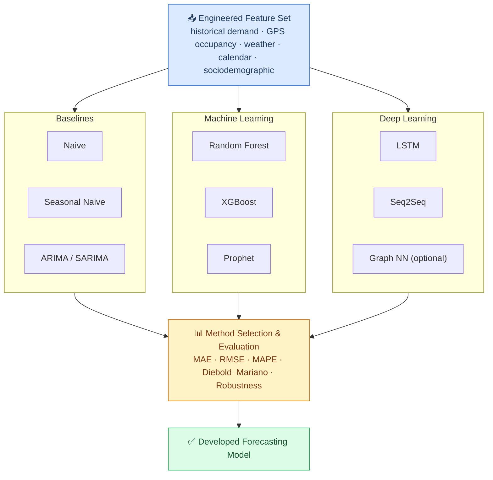

# Methods and Model Families

## Approach

Three families of forecasting methods are evaluated against a common feature set and common evaluation protocol. The best-performing methods from each relevant horizon (short-term and long-term) are selected and integrated into the final developed model.

No method is assumed to dominate in advance. The literature suggests that:

- Statistical baselines are competitive on sparse data and short horizons
- Tree-based ML models handle mixed feature types well and are robust to noise
- Deep learning models achieve highest accuracy when data is abundant and temporal dependencies are complex
- The Sri Lankan context (partial digitisation, event-heavy calendar) makes the relative ordering non-obvious

---

## Candidate methods at a glance

---

## Method pages

| Method family | Page |
|---|---|
| Statistical baselines | [Baselines](./baselines) |
| Machine Learning | [Machine Learning](./machine-learning) |
| Deep Learning | [Deep Learning](./deep-learning) |
| Evaluation protocol | [Evaluation](./evaluation) |

---

## Selection criteria

Method selection uses validation performance under **rolling-origin cross-validation**, evaluated separately for:

1. Short-term horizons (1h, 6h, 24h ahead)
2. Long-term horizons (7d, 30d ahead)

A method may be selected for one horizon and not the other. The final model design may therefore combine two methods — one tuned for short-term accuracy and one for long-term.

**Diebold–Mariano tests** are applied to verify that differences in accuracy between the selected method and baselines are statistically significant, not just descriptive.
