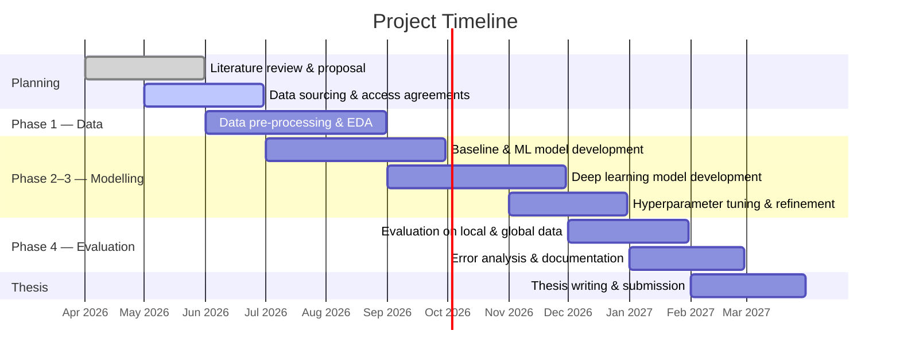

# Project Timeline and Progress

## Gantt chart

The project spans 12 months from **April 2026 to March 2027**. The current date marker shows where we are now.

---

## Current status

| Task | Status | Notes |
|---|---|---|
| Literature review & proposal | **80% complete** | Proposal submitted; literature review substantially done |
| Data sourcing & access agreements | **25% complete** | Initial SLTB and private operator contacts made; discussions ongoing |
| Data pre-processing | Not started | Pending data access |
| Baseline & ML models | Not started | Pending Phase 1 |
| Deep learning models | Not started | Pending Phase 1–2 |
| Hyperparameter tuning | Not started | |
| Evaluation | Not started | |
| Error analysis | Not started | |
| Thesis writing | Not started | |

---

## Milestones

| Milestone | Target month | Status |
|---|---|---|
| Research proposal approved | Month 2 | In progress |
| Dataset assembled and cleaned | Month 5 | Upcoming |
| Baseline models trained and evaluated | Month 6 | Upcoming |
| All candidate models evaluated | Month 9 | Upcoming |
| Final model selected and documented | Month 10 | Upcoming |
| Thesis submitted | Month 12 | Upcoming |

---

## Progress updates

Detailed progress notes are posted to the [Progress Updates blog](/blog) as each phase advances.
