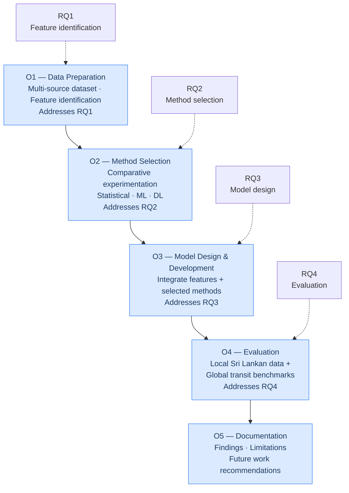

# Aim and Objectives

## Aim

> To design, implement, and rigorously evaluate a data-driven passenger demand forecasting model for Sri Lankan public transport, thereby producing the predictive foundation on which future planning and accessibility-improvement work can build.

---

## Objectives

| Objective | Addresses | Description |
|---|---|---|
| **O1** | RQ1 | Compile and pre-process a multi-source dataset (ridership, GPS/AVL, weather, calendar, census) and identify the features that most strongly predict demand |
| **O2** | RQ2 | Investigate and select the forecasting methods best suited to the Sri Lankan context through comparative experimentation across statistical, ML, and DL families |
| **O3** | RQ3 | Design and develop a demand forecasting model integrating the identified features with the selected methods |
| **O4** | RQ4 | Evaluate the model on both local Sri Lankan data and publicly available global transit datasets |
| **O5** | — | Document findings, limitations, and recommendations for future work |

---

## Scope of inquiry

The research is bounded to:

- **Forecast levels:** route-level and stop-level demand (not network-wide totals)
- **Horizons:** short-term (hourly/daily) and long-term (weekly and longer)
- **Corridors:** a selected set of representative routes covering urban, suburban, and inter-provincial settings
- **Deliverable:** a developed and evaluated forecasting model

See [Scope & Delimitations](./scope) for the full breakdown of what is and isn't covered.
