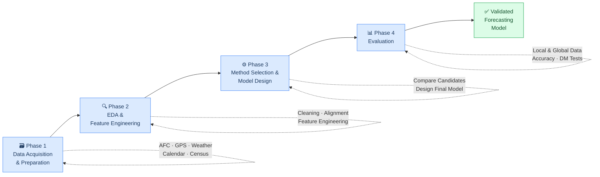

# Research Methodology

## Design Science Research

This study follows the **Design Science Research (DSR)** methodology (Hevner et al., 2004). DSR is the natural fit because the principal outcome is an *artefact* — a forecasting model — evaluated against rigorous criteria. The methodology requires that the artefact be designed to solve an identified problem, built using a principled process, and evaluated in a way that produces generalisable knowledge beyond the specific instance.

---

## Four-phase framework

The work is organised into four sequential phases, each feeding the next:

Each phase feeds the next. The final phase produces a **validated forecasting model** as the project's deliverable.

| Phase | Key activities | Output |
|---|---|---|
| [Phase 1 — Data Collection](./phase1-data) | Sourcing, access agreements, cleaning, alignment | Unified spatial-temporal dataset |
| [Phase 2 — EDA](./phase2-eda) | Descriptive stats, visualisations, correlation analysis | Feature set, engineering decisions |
| [Phase 3 — Method Selection & Model Design](./phase3-methods) | Comparative experiments, candidate selection, model design | Developed forecasting model |
| [Phase 4 — Evaluation](./phase4-evaluation) | Local and global holdout testing, accuracy metrics, error analysis | Evaluated model with documented performance |

---

## Why this structure?

The phased structure reflects the logical dependencies in the work:

- You cannot select a model before understanding the features (Phase 1 → 2 → 3)
- You cannot evaluate a model before building it (Phase 3 → 4)
- Running comparative experiments *before* committing to a final model design (Phase 3) avoids the common pitfall of selecting a method based on intuition and then evaluating it in isolation

The Design Science framework also requires documentation of *where the model succeeds and fails*, not just its peak accuracy — which is why Phase 4 includes error analysis and a systematic characterisation of limitations.

---

## Reference

Hevner, A. R., March, S. T., Park, J., & Ram, S. (2004). Design Science in Information Systems Research. *MIS Quarterly*, 28(1), 75–105.
