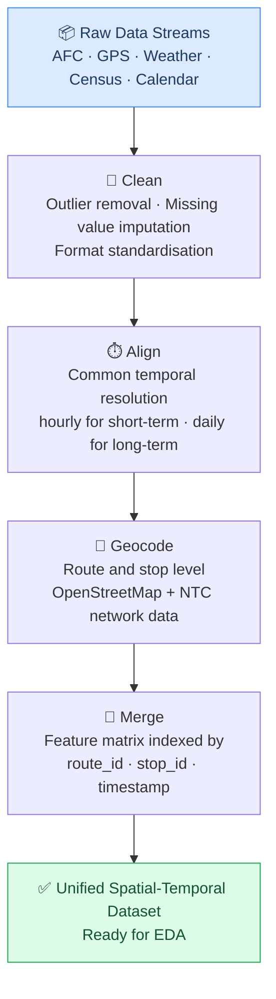

# Phase 1 — Data Collection and Preparation

## Objective

To compile, align, and prepare a multi-source spatial-temporal dataset covering the selected representative corridors, providing clean inputs for exploratory analysis and model development.

---

## Data sources

Five data streams will be combined:

### 1. AFC ticketing records (SLTB & private operators)
- **What:** Automatic Fare Collection transaction records — timestamp, route, stop, fare paid
- **Who:** SLTB depots and private operator associations
- **Access:** Subject to formal access agreements. Discussions with one operator are ongoing.
- **Known issues:** Partial digitisation; coverage varies by operator and route

### 2. GPS / AVL feeds (NTC tracking platforms)
- **What:** Vehicle GPS coordinates with timestamps, stop arrival/departure events
- **Who:** National Transport Commission tracking initiatives
- **Use:** Derive occupancy proxies from dwell times at stops where AFC data is unavailable

### 3. Weather observations (Department of Meteorology)
- **What:** Hourly temperature, rainfall, humidity aligned to the corridor regions
- **Why:** Weather is a known demand driver — heavy rain suppresses demand on some routes and increases it on others

### 4. Socio-demographic context (Department of Census & Statistics)
- **What:** Population density, income distribution, vehicle ownership rates along selected corridors
- **Use:** Static contextual features for route-level demand baseline estimation

### 5. Calendar data
- **What:** Sri Lankan public holidays, school term dates, major festivals (Vesak, Thai Pongal, Sinhala & Tamil New Year, Eid)
- **Why:** Calendar effects are among the strongest demand drivers for public transport in Sri Lanka

---

## Integration pipeline

Where AFC ticketing data is unavailable, **proxy variables** will be used: on-board occupancy estimated from GPS dwell times at stops.

---

## Fallback for data access constraints

Obtaining operator data in Sri Lanka can be slow and subject to NDA requirements. The project has three contingencies:

1. **Proxy occupancy from GPS** (described above) — partially substitutes for AFC data
2. **Publicly available global datasets** — used in Phase 4 evaluation regardless; can inform Phase 3 if local data is delayed
3. **Scope reduction** — if a specific corridor proves inaccessible, substitute an accessible one with comparable characteristics

---

## Corridors

The selected corridors will represent three settings:

| Setting | Region | Rationale |
|---|---|---|
| Urban | Colombo | High frequency, digitised data most likely available |
| Suburban | Gampaha / Kalutara | Transition zone between urban density and rural demand patterns |
| Inter-provincial | TBD | Tests model generalisability beyond the Western Province |

Final corridor selection is subject to data availability confirmed in Phase 1.
