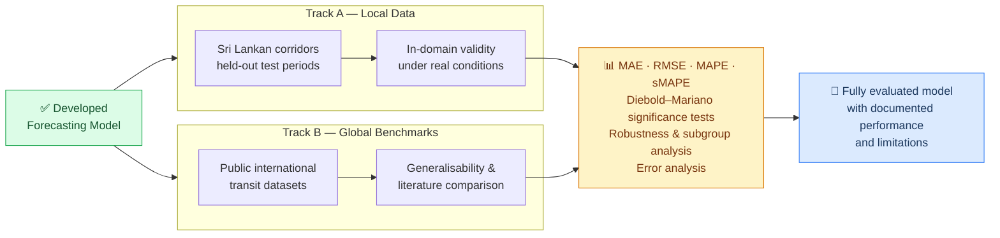

# Phase 4 — Evaluation Plan

## Objective

To produce a rigorous, evidence-based characterisation of the developed forecasting model's accuracy, generalisability, and failure modes — addressing **RQ4**.

---

## Two-track evaluation

The developed model is evaluated on two classes of held-out data:

### Track A — Local datasets
Held-out test periods from the Sri Lankan corridors used for development.

- **Purpose:** Assess in-domain validity under the actual conditions the model is designed for
- **Method:** Final time-slice holdout (not used in any training or validation fold)
- **Coverage:** All selected corridors; disaggregated by urban/suburban/inter-provincial

### Track B — Global datasets
Publicly available international transit benchmarks from the literature.

- **Purpose:** Assess generalisability and enable comparison with published results
- **Examples:** Smart-card and station-level passenger flow datasets used by Toqué et al. (2017) and Ma et al. (2019)
- **Method:** Zero-shot evaluation (model trained on local data, tested on global benchmarks) and/or fine-tuned evaluation

---

## Metrics

### Accuracy metrics
| Metric | Formula | Why it's used |
|---|---|---|
| MAE | Mean of \|actual − forecast\| | Interpretable in original units (passengers) |
| RMSE | √(mean of (actual − forecast)²) | Penalises large errors more heavily |
| MAPE | Mean of \|actual − forecast\| / actual × 100 | Scale-independent, useful for cross-corridor comparison |
| sMAPE | Symmetric version of MAPE | Handles near-zero demand periods without blowing up |

### Statistical significance
**Diebold–Mariano (DM) tests** are used to assess whether the developed model's accuracy differs *significantly* from baselines — not just descriptively, but with a formal test of predictive accuracy equality (Diebold & Mariano, 1995).

### Robustness and subgroup analysis
Performance is disaggregated across:

- Data sparsity conditions (corridors with partial AFC coverage)
- Weekdays vs weekends
- Peak vs off-peak periods
- Special events and public holidays
- Short-term vs long-term forecast horizons

### Error analysis
- Residual examination to identify systematic prediction failures
- Identification of conditions under which the model consistently over- or under-forecasts
- Documentation of limitations for future work

---

## Outcome

A fully documented and evaluated forecasting model with:

1. Quantitative accuracy results on both local and global data
2. Statistical significance relative to baselines
3. Subgroup performance breakdown
4. An honest characterisation of where the model performs well and where it does not

---

## Reference

Diebold, F. X., & Mariano, R. S. (1995). Comparing Predictive Accuracy. *Journal of Business & Economic Statistics*, 13(3), 253–263.
