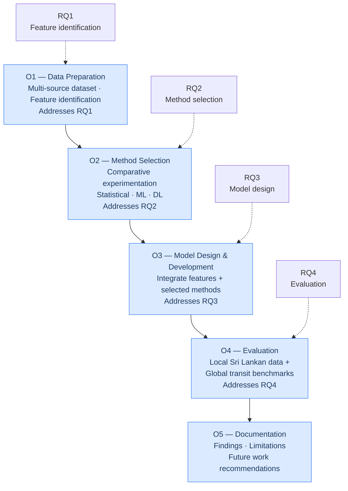

# Research Questions and Objectives

## Primary research question

> **How can a data-driven passenger demand forecasting model be developed and rigorously evaluated for the Sri Lankan public transport context using heterogeneous operational data?**

---

## Sub-questions

### RQ1 — Feature identification
*Which combinations of features (historical ridership, GPS/AVL data, weather, calendar events, socio-demographic indicators) most strongly predict passenger demand on Sri Lankan corridors?*

Understanding which inputs matter is a prerequisite for model design. Feature importance analysis across model families, combined with correlation analysis from the EDA phase, will answer this question.

### RQ2 — Method selection
*What forecasting methods are best suited for accurate short-term and long-term passenger demand prediction in the Sri Lankan context?*

The answer cannot be assumed from the broader literature, because Sri Lankan data has distinct characteristics (partial digitisation, data gaps, calendar effects tied to local events). Comparative experimentation across statistical, ML, and DL families is required.

### RQ3 — Model design and development
*How can a passenger demand forecasting model be designed and developed using the identified factors and selected methods?*

Once the best-performing methods and most informative features are known, this question addresses how they are integrated into a coherent model — specifying input representation, architecture, and training procedure.

### RQ4 — Evaluation
*How can the validity and performance of the developed model be evaluated using both local and global datasets?*

Evaluation on held-out local data assesses in-domain validity. Evaluation on public international benchmarks assesses generalisability and enables comparison with published results.

---

## Objectives

| Objective | Addresses | Description |
|---|---|---|
| **O1** | RQ1 | Compile and pre-process a multi-source dataset (ridership, GPS/AVL, weather, calendar, census) and identify the features that most strongly predict demand |
| **O2** | RQ2 | Investigate and select the forecasting methods best suited to the Sri Lankan context through comparative experimentation across statistical, ML, and DL families |
| **O3** | RQ3 | Design and develop a demand forecasting model integrating the identified features with the selected methods |
| **O4** | RQ4 | Evaluate the model on both local Sri Lankan data and publicly available global transit datasets |
| **O5** | — | Document findings, limitations, and recommendations for future work |

---

## Scope of inquiry

The research is bounded to:

- **Forecast levels:** route-level and stop-level demand (not network-wide totals)
- **Horizons:** short-term (hourly/daily) and long-term (weekly and longer)
- **Corridors:** a selected set of representative routes covering urban, suburban, and inter-provincial settings
- **Deliverable:** a developed and evaluated forecasting model

**Out of scope:** integration of forecasts into planning workflows, accessibility indicator construction, dashboard development, real-time deployment, causal inference on policy interventions, nationwide coverage, and demand for informal transport modes (three-wheelers, taxis, ride-hailing).
