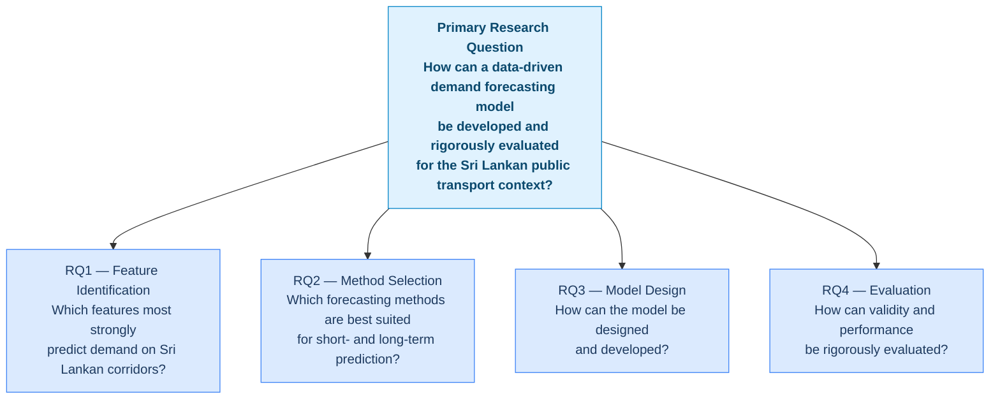

# Research Questions

## Primary research question

> **How can a data-driven passenger demand forecasting model be developed and rigorously evaluated for the Sri Lankan public transport context using heterogeneous operational data?**

This is decomposed into four sub-questions, each targeting a distinct aspect of the problem:

---

## Sub-questions

### RQ1 — Feature identification

> *Which combinations of features (historical ridership, GPS/AVL data, weather, calendar events, socio-demographic indicators) most strongly predict passenger demand on Sri Lankan corridors?*

Understanding which inputs matter is a prerequisite for model design. Feature importance analysis across model families, combined with correlation analysis from the EDA phase, will answer this question. Addressed by **Objective O1**.

### RQ2 — Method selection

> *What forecasting methods are best suited for accurate short-term and long-term passenger demand prediction in the Sri Lankan context?*

The answer cannot be assumed from the broader literature, because Sri Lankan data has distinct characteristics — partial digitisation, data gaps, and calendar effects tied to local events. Comparative experimentation across statistical, ML, and DL families is required. Addressed by **Objective O2**.

### RQ3 — Model design and development

> *How can a passenger demand forecasting model be designed and developed using the identified factors and selected methods?*

Once the best-performing methods and most informative features are known, this question addresses how they are integrated into a coherent model — specifying input representation, architecture, and training procedure. Addressed by **Objective O3**.

### RQ4 — Evaluation

> *How can the validity and performance of the developed model be evaluated using both local and global datasets?*

Evaluation on held-out local data assesses in-domain validity. Evaluation on public international benchmarks assesses generalisability and enables comparison with published results. Addressed by **Objective O4**.
