# Scope, Delimitations, and Justifications

## In scope

- Passenger demand forecasting at the **route and stop level** for a selected set of representative corridors covering urban (Colombo), suburban (Gampaha/Kalutara), and inter-provincial settings.
- Both **SLTB and private operator** services within the selected corridors, subject to data availability.
- **Short-term** (hourly/daily) and **long-term** (weekly and longer) forecast horizons.
- Comparative evaluation of candidate methods drawn from statistical, ML, and DL families, leading to the design and development of an integrated forecasting model.
- Validation of the developed model on both **local Sri Lankan data** and publicly available **global transit datasets**.

---

## Out of scope (delimitations)

### Operationalisation of the forecasts
The integration of forecasts into planning workflows, the construction of an accessibility indicator, and the design of dashboards or tools that translate forecasts into accessibility outcomes are all out of scope. The project deliberately ends at a rigorously evaluated forecasting model. Building on top of that model is left as recommended future work.

### Long-horizon planning (5+ years)
Excluded because long-term forecasts require land-use and macroeconomic models beyond the scope of a one-year project.

### Nationwide coverage
Excluded in favour of selected representative corridors, since obtaining and cleaning country-wide data within the project's timeframe is not feasible. Insights obtained from the chosen corridors are intended to be generalisable to the wider network.

### Causal inference on policy interventions
The project forecasts demand but does not attempt to attribute observed changes to specific policies.

### Real-time deployment
Models will be evaluated in batch on historical data. Productionisation, streaming inference, and operator-side integration are not part of this project.

### Demand for informal services
Three-wheelers, taxis, and ride-hailing are excluded due to the absence of systematic ridership data for these modes.

---

## Justification

These delimitations are justified by three factors:

1. **Available time** — the project runs for 12 months; the core forecasting problem is already ambitious within that constraint
2. **Data access constraints** — operational data from Sri Lankan operators requires formal agreements and is subject to availability; nationwide coverage within a single project year is not feasible
3. **Tractability and rigour** — a tightly bounded research question is more rigorously evaluable than a broad one; the scope is set to ensure the deliverable (a developed and evaluated forecasting model) can be produced and assessed to a high standard

```mermaid
flowchart LR
    subgraph IN["✅ In Scope"]
        direction TB
        I1["Route & stop level\ndemand forecasting"]
        I2["SLTB & private\noperator corridors"]
        I3["Short-term &\nlong-term horizons"]
        I4["Statistical · ML · DL\nmodel comparison"]
        I5["Local + global\ndataset evaluation"]
    end

    subgraph OUT["🚫 Out of Scope"]
        direction TB
        O1["Forecast operationalisation\n& dashboards"]
        O2["5+ year planning\nhorizons"]
        O3["Nationwide\ncoverage"]
        O4["Causal inference\non policies"]
        O5["Real-time\ndeployment"]
        O6["Informal transport\nmodes"]
    end

    IN ~~~|"Delimitations justified by: time · data access · tractability"| OUT
```

