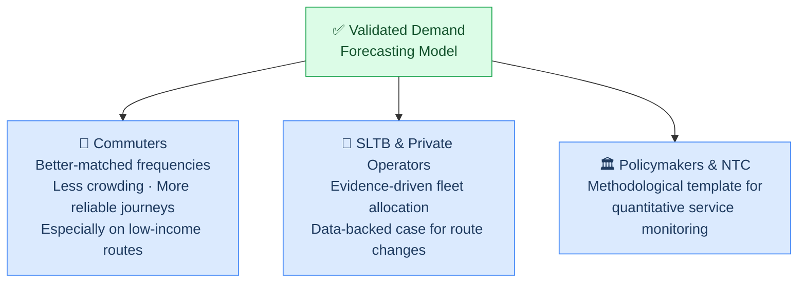

# Significance of the Project

## Contribution to Information Systems

The project contributes to Information Systems research in three ways.

**1. A reusable data integration methodology.**
The project produces a reusable methodology for integrating heterogeneous, imperfect operational data sources — a recurring challenge in the developing-country public transport context. Fragmented data, partial digitisation, and inconsistent quality are not unique to Sri Lanka; the integration approach developed here is applicable to similar settings elsewhere.

**2. An empirical study under realistic data constraints.**
The project offers a comparative empirical study of statistical, ML, and deep learning forecasting methods under realistic data constraints, complementing the largely high-resource studies that dominate the existing literature. Most published benchmarks assume clean, continuous, large-scale data; the Sri Lankan setting tests method robustness under conditions closer to the global norm than to the exception.

**3. Practical guidance for IS-driven analytics in under-digitised domains.**
The project documents the practical considerations — data quality trade-offs, feature engineering choices, model selection rationale — involved in building predictive systems for domains that have historically relied on manual surveys. This provides a reference point for similar IS-driven analytics projects in transport, healthcare, or utilities where digital data infrastructure is still maturing.

---

## Benefits to society

The direct deliverable of this project is a validated forecasting model and the empirical evidence accompanying it. The broader societal benefit lies in what such forecasts make possible downstream.

**For commuters**, when demand forecasts are incorporated into planning decisions — in follow-on work or by industry partners — Sri Lankan commuters stand to benefit from better-matched service frequencies, less crowding, and more reliable journeys, particularly on routes serving low- and middle-income communities.

**For SLTB and private operators**, the model offers a basis for future evidence-driven fleet allocation, replacing the current reliance on infrequent manual surveys and operator intuition.

**For policymakers and the National Transport Commission**, the project provides a methodological template for quantitative monitoring of service provision — a foundation on which performance reporting and accountability frameworks can be built.

Although the empirical work is conducted on a defined subset of the system, the methodology is intended to yield insights that can inform the broader public transport sector in Sri Lanka.

---

:::note Scope reminder
The direct outputs of this project are the forecasting model and its documentation. The societal benefits described above depend on follow-on work that applies those forecasts to operational decisions — this is deliberately left as future work.
:::
